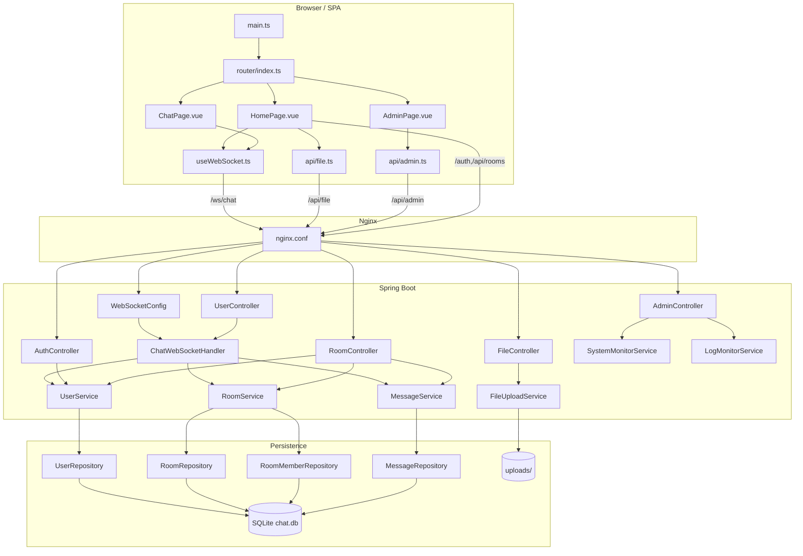

# websocket-chat 架构概览

## 核心判断
- 这是一个前后端分离的实时聊天系统。
- 前端使用 Vue 3 + Vite，后端使用 Spring Boot + Spring WebSocket + Spring Data JPA。
- 实时消息走 WebSocket，登录、文件上传、房间管理和管理员监控走 HTTP。
- 数据持久化落在 SQLite，部署层通过 Nginx 统一承接静态资源、API、文件访问和 WebSocket 代理。

## 架构图

## 关键运行链路
1. 前端启动后由 `main.ts` 挂载应用，`router/index.ts` 决定进入首页、聊天页或管理页。
2. 聊天页和首页都依赖 `useWebSocket.ts`，它负责建立 `/ws/chat` 连接、发送 `user:join`、`room:list`、`room:sync` 等事件，并维护 rooms/messages/unreadCounts 状态。
3. 后端 `WebSocketConfig` 将 `/ws/chat` 绑定到 `ChatWebSocketHandler`。该 handler 根据事件类型把请求分发到用户、房间、消息等服务。
4. `MessageService`、`RoomService`、`UserService` 再通过 Spring Data Repository 读写 SQLite 中的用户、房间、成员和消息数据。
5. 文件上传不走 WebSocket，而是经 `FileController -> FileUploadService -> uploads/` 落地文件，再通过消息里的 file metadata 在聊天流中广播。
6. 管理员页面通过 `AdminController` 获取 CPU、内存、JVM、日志信息，且 `WebMvcConfig` 会给 `/api/admin/**` 加上 IP 白名单拦截。
7. Nginx 对外统一提供静态页面、文件访问、HTTP API 和 WebSocket 代理，因此浏览器侧大多数请求都能用同一 host 完成。

## 结构特点
- 实时层和 HTTP 层分工清晰，WebSocket 负责聊天事件，HTTP 负责补充性业务。
- 业务规则集中在 service，controller 和 websocket handler 主要做协议编排。
- 前端状态没有拆成 Pinia store，而是集中在 `useWebSocket.ts` 里管理，这让开发更直接，但也让该文件成为明显的复杂度中心。
- `HomePage.vue` 和 `ChatWebSocketHandler.java` 都是当前项目的“重文件”，分别承担大量 UI 和协议逻辑，是后续重构的优先对象。
