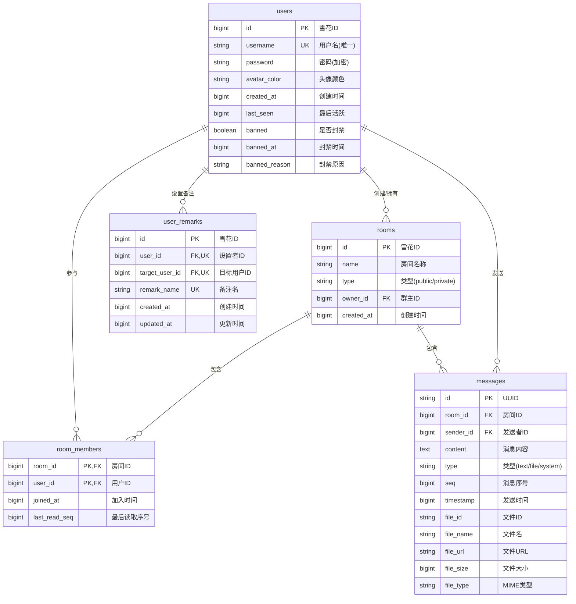

# SQLite 数据库表结构设计文档

本文档详细描述 WebSocket 即时聊天系统的 SQLite 数据库表结构设计。

## 1. 数据库概述

- **数据库类型**: SQLite（嵌入式数据库）
- **数据库文件位置**: `backend/data/chat.db`
- **ORM 框架**: Spring Data JPA + Hibernate
- **方言**: SQLiteDialect（Hibernate Community Dialect）
- **ID 生成策略**: Snowflake 算法（64 位全局唯一 ID）

## 2. 表结构概览

| 表名 | 描述 | 实体类 |
|------|------|--------|
| `users` | 用户信息表 | `User.java` |
| `rooms` | 聊天房间表 | `Room.java` |
| `room_members` | 房间成员关系表 | `RoomMember.java` |
| `messages` | 消息记录表 | `Message.java` |
| `user_remarks` | 用户备注表 | `UserRemark.java` |

## 3. 实体关系图



## 4. 详细表结构

### 4.1 users 表（用户信息）

存储所有注册用户的基本信息，包括封禁状态。

| 字段名 | 数据类型 | 约束 | 描述 |
|--------|----------|------|------|
| `id` | BIGINT | PRIMARY KEY | 用户 ID（Snowflake 生成） |
| `username` | VARCHAR(32) | NOT NULL, UNIQUE | 用户名（唯一） |
| `password` | VARCHAR(128) | NULL | 密码（BCrypt 加密存储） |
| `avatar_color` | VARCHAR(7) | NULL | 头像颜色（HEX 格式，如 #FF5733） |
| `created_at` | BIGINT | NOT NULL | 创建时间戳（毫秒） |
| `last_seen` | BIGINT | NULL | 最后活跃时间戳（毫秒） |
| `banned` | BOOLEAN | NOT NULL, DEFAULT FALSE | 是否被封禁 |
| `banned_at` | BIGINT | NULL | 封禁时间戳（毫秒） |
| `banned_reason` | VARCHAR(255) | NULL | 封禁原因 |

**索引**:
- PRIMARY KEY: `id`
- UNIQUE INDEX: `username`

**对应实体类**: [User.java](backend/src/main/java/com/chat/entity/User.java)

```java
@Entity
@Table(name = "users")
public class User {
    @Id
    private Long id;
    
    @Column(nullable = false, unique = true, length = 32)
    private String username;
    
    @Column(length = 128)
    private String password;
    
    @Column(name = "avatar_color", length = 7)
    private String avatarColor;
    
    @Column(name = "created_at", nullable = false)
    private Long createdAt;
    
    @Column(name = "last_seen")
    private Long lastSeen;
    
    @Column(nullable = false)
    private boolean banned = false;
    
    @Column(name = "banned_at")
    private Long bannedAt;
    
    @Column(name = "banned_reason", length = 255)
    private String bannedReason;
}
```

### 4.2 rooms 表（聊天房间）

存储所有聊天房间信息，包括群聊和私聊。

| 字段名 | 数据类型 | 约束 | 描述 |
|--------|----------|------|------|
| `id` | BIGINT | PRIMARY KEY | 房间 ID（Snowflake 生成） |
| `name` | VARCHAR(64) | NOT NULL | 房间名称 |
| `type` | VARCHAR(16) | NOT NULL | 房间类型（`public` 或 `private`） |
| `owner_id` | BIGINT | NULL | 群主用户 ID（私聊房间为 NULL） |
| `created_at` | BIGINT | NOT NULL | 创建时间戳（毫秒） |

**索引**:
- PRIMARY KEY: `id`

**对应实体类**: [Room.java](backend/src/main/java/com/chat/entity/Room.java)

```java
@Entity
@Table(name = "rooms")
public class Room {
    @Id
    private Long id;
    
    @Column(nullable = false, length = 64)
    private String name;
    
    @Column(nullable = false, length = 16)
    private String type;  // 'public' | 'private'
    
    @Column(name = "owner_id")
    private Long ownerId;
    
    @Column(name = "created_at", nullable = false)
    private Long createdAt;
}
```

### 4.3 room_members 表（房间成员关系）

存储用户与房间的多对多关系，使用复合主键。

| 字段名 | 数据类型 | 约束 | 描述 |
|--------|----------|------|------|
| `room_id` | BIGINT | PRIMARY KEY, FOREIGN KEY | 房间 ID |
| `user_id` | BIGINT | PRIMARY KEY, FOREIGN KEY | 用户 ID |
| `joined_at` | BIGINT | NOT NULL | 加入时间戳（毫秒） |
| `last_read_seq` | BIGINT | DEFAULT 0 | 最后读取的消息序号 |

**索引**:
- PRIMARY KEY: (`room_id`, `user_id`) - 复合主键

**外键关系**:
- `room_id` → `rooms.id`
- `user_id` → `users.id`

**对应实体类**: [RoomMember.java](backend/src/main/java/com/chat/entity/RoomMember.java), [RoomMemberId.java](backend/src/main/java/com/chat/entity/RoomMemberId.java)

```java
@Entity
@Table(name = "room_members")
@IdClass(RoomMemberId.class)
public class RoomMember {
    @Id
    @Column(name = "room_id")
    private Long roomId;
    
    @Id
    @Column(name = "user_id")
    private Long userId;
    
    @Column(name = "joined_at", nullable = false)
    private Long joinedAt;
    
    @Column(name = "last_read_seq")
    private Long lastReadSeq = 0L;
}
```

### 4.4 messages 表（消息记录）

存储所有聊天消息，包括文本消息、文件消息和系统消息。

| 字段名 | 数据类型 | 约束 | 描述 |
|--------|----------|------|------|
| `id` | VARCHAR(36) | PRIMARY KEY | 消息 ID（UUID） |
| `room_id` | BIGINT | NOT NULL, FOREIGN KEY | 房间 ID |
| `sender_id` | BIGINT | NOT NULL, FOREIGN KEY | 发送者用户 ID |
| `content` | TEXT | NOT NULL | 消息内容 |
| `type` | VARCHAR(16) | NULL | 消息类型（`text`、`file`、`system`） |
| `seq` | BIGINT | NULL | 房间内消息序号 |
| `timestamp` | BIGINT | NOT NULL | 发送时间戳（毫秒） |
| `file_id` | VARCHAR(64) | NULL | 文件 ID（文件消息） |
| `file_name` | VARCHAR(256) | NULL | 原始文件名（文件消息） |
| `file_url` | VARCHAR(512) | NULL | 文件访问 URL（文件消息） |
| `file_size` | BIGINT | NULL | 文件大小（字节） |
| `file_type` | VARCHAR(32) | NULL | 文件 MIME 类型 |

**索引**:
- PRIMARY KEY: `id`

**外键关系**:
- `room_id` → `rooms.id`
- `sender_id` → `users.id`

**消息类型说明**:
- `text`: 文本消息，`content` 存储文本内容
- `file`: 文件消息，`content` 存储文件描述，文件信息存储在附加字段
- `system`: 系统消息，如用户加入/离开通知

**对应实体类**: [Message.java](backend/src/main/java/com/chat/entity/Message.java)

```java
@Entity
@Table(name = "messages")
public class Message {
    @Id
    private String id;  // UUID
    
    @Column(name = "room_id", nullable = false)
    private Long roomId;
    
    @Column(name = "sender_id", nullable = false)
    private Long senderId;
    
    @Column(columnDefinition = "TEXT", nullable = false)
    private String content;
    
    @Column(length = 16)
    private String type;  // 'text' | 'file' | 'system'
    
    private Long seq;
    
    @Column(nullable = false)
    private Long timestamp;
    
    @Column(name = "file_id", length = 64)
    private String fileId;
    
    @Column(name = "file_name", length = 256)
    private String fileName;
    
    @Column(name = "file_url", length = 512)
    private String fileUrl;
    
    @Column(name = "file_size")
    private Long fileSize;
    
    @Column(name = "file_type", length = 32)
    private String fileType;
}
```

### 4.5 user_remarks 表（用户备注）

存储用户对其他用户设置的备注名，仅自己可见。

| 字段名 | 数据类型 | 约束 | 描述 |
|--------|----------|------|------|
| `id` | BIGINT | PRIMARY KEY | 备注记录 ID（Snowflake 生成） |
| `user_id` | BIGINT | NOT NULL, UNIQUE(user_id, target_user_id) | 设置备注的用户 ID |
| `target_user_id` | BIGINT | NOT NULL, UNIQUE(user_id, target_user_id) | 被备注的用户 ID |
| `remark_name` | VARCHAR(100) | NOT NULL | 备注名称 |
| `created_at` | BIGINT | NOT NULL | 创建时间戳（毫秒） |
| `updated_at` | BIGINT | NOT NULL | 更新时间戳（毫秒） |

**索引**:
- PRIMARY KEY: `id`
- UNIQUE INDEX: (`user_id`, `target_user_id`) - 复合唯一约束

**外键关系**:
- `user_id` → `users.id`
- `target_user_id` → `users.id`

**对应实体类**: [UserRemark.java](backend/src/main/java/com/chat/entity/UserRemark.java)

```java
@Entity
@Table(name = "user_remarks", uniqueConstraints = @UniqueConstraint(columnNames = { "user_id", "target_user_id" }))
public class UserRemark {
    @Id
    private Long id;
    
    @Column(name = "user_id", nullable = false)
    private Long userId;
    
    @Column(name = "target_user_id", nullable = false)
    private Long targetUserId;
    
    @Column(name = "remark_name", nullable = false, length = 100)
    private String remarkName;
    
    @Column(name = "created_at", nullable = false)
    private Long createdAt;
    
    @Column(name = "updated_at", nullable = false)
    private Long updatedAt;
}
```

## 5. 表关系说明

### 5.1 用户与房间（User - Room）

- **一对多关系**: 一个用户可以创建/拥有多个群聊房间
- `rooms.owner_id` → `users.id`
- 私聊房间（`type = 'private'`）的 `owner_id` 为 NULL

### 5.2 用户与房间成员（User - RoomMember）

- **多对多关系**: 通过 `room_members` 表实现
- 一个用户可以加入多个房间
- 一个房间可以包含多个成员

### 5.3 房间与消息（Room - Message）

- **一对多关系**: 一个房间包含多条消息
- `messages.room_id` → `rooms.id`
- 消息按 `seq` 字段排序，保证顺序性

### 5.4 用户与消息（User - Message）

- **一对多关系**: 一个用户可以发送多条消息
- `messages.sender_id` → `users.id`

### 5.5 用户与备注（User - UserRemark）

- **一对多关系**: 一个用户可以设置多个备注
- `user_remarks.user_id` → `users.id`（设置者）
- `user_remarks.target_user_id` → `users.id`（被备注者）
- 复合唯一约束保证每个用户对同一目标用户只能有一个备注

## 6. 数据访问层（Repository）

| Repository | 对应表 | 主要方法 |
|------------|--------|----------|
| `UserRepository` | `users` | `findByUsername()`, `findAll()` |
| `RoomRepository` | `rooms` | `findById()`, `findByType()`, `findPrivateRoom()` |
| `RoomMemberRepository` | `room_members` | `findByRoomId()`, `findByUserId()`, `findByRoomIdAndUserId()` |
| `MessageRepository` | `messages` | `findByRoomId()`, `findByRoomIdAndSeqGreaterThan()` |
| `UserRemarkRepository` | `user_remarks` | `findByUserId()`, `findByUserIdAndTargetUserId()` |

## 7. ID 生成策略

### 7.1 Snowflake ID（64 位）

用于 `users`、`rooms`、`user_remarks` 表的主键。

- **结构**: 时间戳（41位） + 机器ID（10位） + 序列号（12位）
- **特点**: 全局唯一、趋势递增、高性能
- **实现**: [SnowflakeIdGenerator.java](backend/src/main/java/com/chat/utils/SnowflakeIdGenerator.java)

### 7.2 UUID（36 位字符串）

用于 `messages` 表的主键。

- **格式**: 32 位十六进制字符 + 4 个连字符
- **特点**: 全局唯一、无序
- **适用场景**: 消息 ID 不需要排序，使用 UUID 更简单

## 8. 数据库配置

```properties
spring.datasource.url=jdbc:sqlite:./data/chat.db
spring.datasource.driver-class-name=org.sqlite.JDBC
spring.jpa.database-platform=org.hibernate.community.dialect.SQLiteDialect
spring.jpa.hibernate.ddl-auto=update
```

**配置说明**:
- `ddl-auto=update`: Hibernate 自动创建/更新表结构
- SQLite 不支持复杂的外键约束，Hibernate 会忽略外键定义
- 数据库文件存储在 `backend/data/chat.db`

## 9. 注意事项

1. **Long 类型序列化**: JavaScript Number 类型无法精确表示 64 位整数，所有 Long 字段使用 `@JsonSerialize(using = ToStringSerializer.class)` 序列化为字符串

2. **复合主键**: `room_members` 表使用 `@IdClass` 定义复合主键，需要单独的 `RoomMemberId` 类实现 `equals()` 和 `hashCode()`

3. **时间戳格式**: 所有时间戳字段使用 BIGINT 存储毫秒级 Unix 时间戳

4. **文件存储**: 文件元数据存储在 `messages` 表的附加字段中，实际文件存储在 `backend/uploads/` 目录

5. **SQLite 限制**: SQLite 不支持复杂的 ALTER TABLE 操作，表结构变更可能需要重建数据库

## 10. 相关文档

- [README.md](README.md) - 项目概述
- [Technical_Architecture.md](Technical_Architecture.md) - 技术架构
- [project-structure.md](project-structure.md) - 项目结构