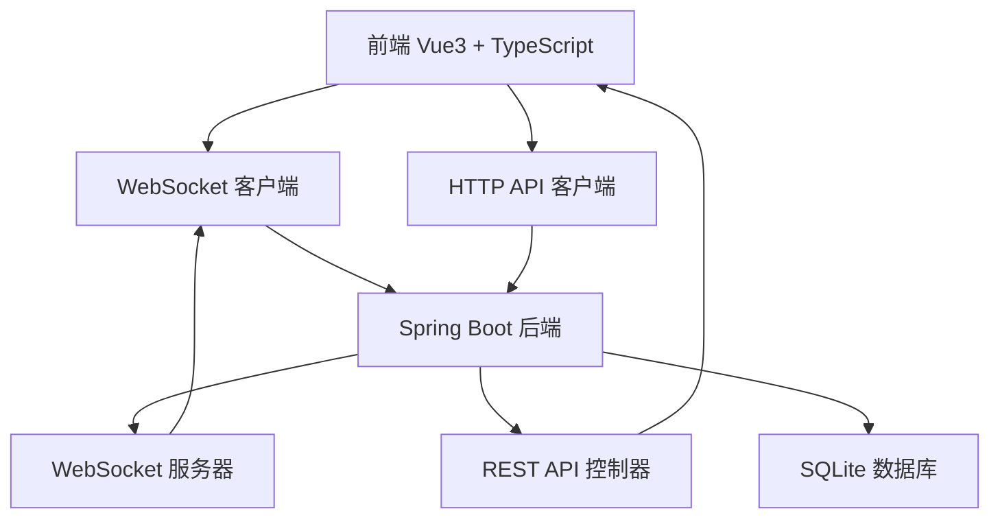
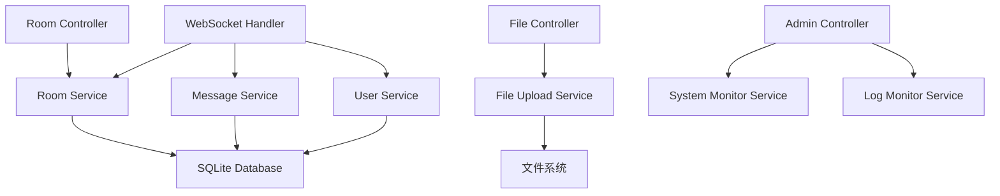
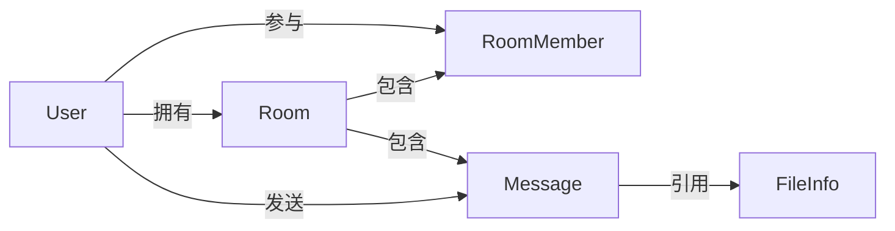

## 1. 架构设计



## 2. 技术栈

- **前端**: Vue 3 + TypeScript + Vite + Tailwind CSS
- **后端**: Spring Boot 3.0 + Spring WebSocket + Spring Data JPA
- **数据库**: SQLite（持久化存储）
- **部署**: Nginx 反向代理

## 3. 路由定义

| 路由 | 用途 |
|------|------|
| `/` | 首页，用户登录和聊天列表 |
| `/chat/:chatId` | 聊天页面，显示特定聊天的消息 |
| `/admin` | 管理员监控页面 |

## 4. API 定义

### 4.1 WebSocket 事件

| 事件类型 | 方向 | 数据结构 | 说明 |
|----------|------|----------|------|
| `user:join` | 客户端→服务器 | `{userId: string, username: string}` | 用户加入系统 |
| `user:joined` | 服务器→客户端 | `{userId: string, username: string}` | 通知其他用户有新用户加入 |
| `message:send` | 客户端→服务器 | `{roomId: string, content: string, senderId: string, type: 'text' \| 'file'}` | 发送消息 |
| `message:receive` | 服务器→客户端 | `{roomId: string, content: string, senderId: string, senderName: string, timestamp: number, seq: number}` | 接收消息 |
| `message:file` | 客户端→服务器 | `{roomId: string, fileId: string, fileName: string, fileUrl: string, fileSize: number, fileType: string}` | 发送文件消息 |
| `room:create` | 客户端→服务器 | `{name: string, type: 'public' \| 'private'}` | 创建房间 |
| `room:created` | 服务器→客户端 | `{room: Room}` | 房间创建成功 |
| `room:join` | 客户端→服务器 | `{roomId: string}` | 加入房间 |
| `room:joined` | 服务器→客户端 | `{roomId: string, userId: string, username: string}` | 用户加入房间通知 |
| `room:invite` | 客户端→服务器 | `{roomId: string, userId: string}` | 邀请用户加入房间 |
| `room:list` | 客户端→服务器 | `{userId: string}` | 获取用户的房间列表 |
| `room:list:response` | 服务器→客户端 | `{rooms: Room[]}` | 返回房间列表 |
| `room:history` | 客户端→服务器 | `{roomId: string, lastSeq?: number}` | 获取房间历史消息 |
| `room:sync` | 客户端→服务器 | `{roomId: string, lastSeq: number}` | 同步房间最新消息 |
| `user:list` | 客户端→服务器 | `{}` | 获取在线用户列表 |
| `user:list:response` | 服务器→客户端 | `{users: User[]}` | 返回在线用户列表 |

### 4.2 HTTP 端点

| 方法 | 路径 | 用途 | 请求体 | 响应 |
|------|------|------|--------|------|
| POST | `/api/auth/register` | 用户注册 | `{username: string, password: string}` | `{userId: string, username: string}` |
| POST | `/api/auth/login` | 用户登录 | `{username: string, password: string}` | `{userId: string, username: string}` |
| GET | `/api/users` | 获取在线用户列表 | N/A | `{users: [{userId: string, username: string}]}` |
| POST | `/api/rooms` | 创建房间 | `{name: string, type: 'public' \| 'private'}` | `Room` |
| GET | `/api/rooms` | 获取用户房间列表 | N/A | `Room[]` |
| POST | `/api/rooms/:roomId/join` | 加入房间 | N/A | `{message: string}` |
| POST | `/api/rooms/:roomId/invite` | 邀请用户 | `{userId: string}` | `{message: string}` |
| POST | `/api/rooms/:roomId/kick` | 踢出成员 | `{targetUserId: string}` | `{message: string}` |
| DELETE | `/api/rooms/:roomId` | 解散房间 | N/A | `{message: string}` |
| GET | `/api/rooms/:roomId/history` | 获取房间历史 | N/A | `Message[]` |
| POST | `/api/file/upload` | 上传文件 | `multipart/form-data` | `{fileId: string, fileName: string, fileUrl: string, fileSize: number, fileType: string}` |
| GET | `/files/{fileId}` | 访问上传的文件 | N/A | 文件内容 |
| GET | `/api/admin/health` | 健康检查 | N/A | `{status: string}` |
| GET | `/api/admin/metrics` | 系统监控指标 | N/A | `{cpu: number, memory: number, jvm: object, uptime: number}` |
| GET | `/api/admin/logs` | 获取最近日志 | N/A | `string[]` |
| POST | `/api/admin/logs/clear` | 清空日志缓存 | N/A | `{message: string}` |

## 5. 服务器架构图



## 6. 数据模型

### 6.1 实体关系



### 6.2 数据定义

#### User（用户）
```typescript
interface User {
  id: string;           // 雪花 ID
  username: string;     // 用户名
  password: string;     // 密码（加密存储）
  createdAt: number;    // 创建时间戳
}
```

#### Room（房间）
```typescript
interface Room {
  id: string;           // 雪花 ID
  name: string;         // 房间名称
  type: 'public' | 'private';  // 房间类型
  ownerId: string;      // 群主 ID（群聊）
  createdAt: number;    // 创建时间戳
}
```

#### RoomMember（房间成员）
```typescript
interface RoomMember {
  id: string;           // 雪花 ID
  roomId: string;       // 房间 ID
  userId: string;       // 用户 ID
  joinedAt: number;     // 加入时间
}
```

#### Message（消息）
```typescript
interface Message {
  id: string;           // 雪花 ID
  roomId: string;       // 房间 ID
  senderId: string;     // 发送者 ID
  senderName: string;   // 发送者名称
  content: string;      // 消息内容（文本或文件 ID）
  type: 'text' | 'file' | 'system';  // 消息类型
  seq: number;          // 房间消息序号
  timestamp: number;    // 发送时间戳
}
```

#### FileInfo（文件信息）
```typescript
interface FileInfo {
  id: string;           // 雪花 ID
  fileName: string;     // 原始文件名
  fileUrl: string;      // 访问 URL
  fileSize: number;     // 文件大小（字节）
  fileType: string;     // MIME 类型
  uploadedAt: number;   // 上传时间
}
```

## 7. 核心功能实现

### 7.1 消息序号机制
- 每个房间的消息使用递增序号（seq）
- 保证消息顺序性和完整性
- 支持消息同步和断线重连

### 7.2 雪花 ID 生成
- 使用 Twitter Snowflake 算法
- 生成全局唯一 64 位 ID
- 解决 JavaScript Number 精度问题（序列化为字符串）

### 7.3 文件上传
- 支持最大 500MB 文件
- 文件以 UUID 命名存储
- 支持图片预览和文件下载

### 7.4 管理员功能
- IP 白名单访问控制
- 实时系统监控（CPU、内存、JVM）
- 日志实时查看和清理

## 8. 部署架构

```mermaid
graph LR
    A[浏览器] --> B[Nginx]
    B --> C[前端静态资源]
    B --> D[/api/*]
    B --> E[/ws/chat]
    D --> F[Spring Boot 8081]
    E --> F
    F --> G[SQLite]
    F --> H[uploads/]
```

- Nginx 监听 80 端口
- 前端静态资源由 Nginx 直接服务
- `/api/*` 和 `/ws/chat` 代理到 Spring Boot（8081）
- 上传文件通过 `/files/*` 访问
