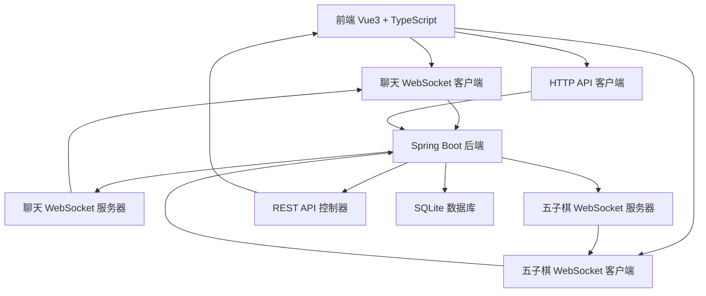
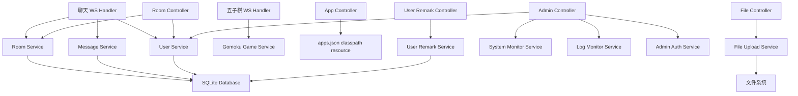
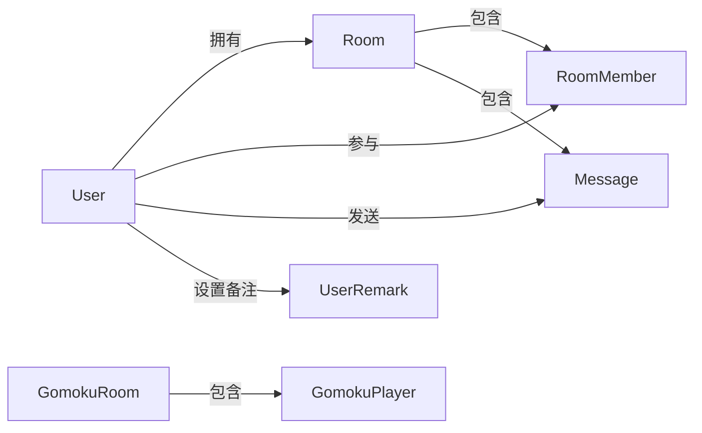

## 1. 架构设计



## 2. 技术栈

- **前端**: Vue 3 + TypeScript + Vite + Tailwind CSS + Pinia + Vue Router + Axios + marked（Markdown 渲染）
- **后端**: Spring Boot 3.2 + Spring WebSocket + Spring Data JPA + Spring Security Crypto
- **数据库**: SQLite（持久化存储）+ 内存（五子棋房间状态）
- **部署**: Nginx 反向代理

## 3. 路由定义

| 路由 | 用途 |
|------|------|
| `/` | 首页，用户登录和聊天列表 |
| `/chat/:chatId` | 聊天页面，显示特定聊天的消息 |
| `/admin` | 管理员监控页面 |
| `/apps` | 应用中心页面（外部项目展示） |
| `/gomoku` | 五子棋大厅（房间列表） |
| `/gomoku/:roomId` | 五子棋对局页面 |

## 4. API 定义

### 4.1 WebSocket 事件 — 聊天系统

所有聊天 WebSocket 消息采用统一的 `{type: string, data: object}` 格式。

| 事件类型 | 方向 | 数据结构 | 说明 |
|----------|------|----------|------|
| `user:join` | 客户端→服务器 | `{userId: string, username: string}` | 用户加入系统 |
| `user:joined` | 服务器→客户端 | `{userId: string, username: string}` | 通知其他用户有新用户加入 |
| `user:left` | 服务器→客户端 | `{userId: string, username: string}` | 通知所有用户有用户离线 |
| `user:banned` | 服务器→客户端 | `{reason: string}` | 通知用户被封禁（随后断开连接） |
| `user:list` | 客户端→服务器 | `{}` | 请求在线用户列表 |
| `user:list:response` | 服务器→客户端 | `{users: [{userId: string, username: string}]}` | 返回在线用户列表 |
| `message:send` | 客户端→服务器 | `{roomId: string, content: string}` | 发送文本消息 |
| `message:new` | 服务器→客户端 | 消息对象 | 接收文本消息 |
| `message:send:file` | 客户端→服务器 | 文件消息对象 | 发送文件消息 |
| `message:new:file` | 服务器→客户端 | 文件消息对象 | 接收文件消息 |
| `message:history` | 客户端→服务器 | `{roomId: string}` | 请求房间历史消息 |
| `message:history:response` | 服务器→客户端 | `{roomId: string, messages: Message[]}` | 返回历史消息 |
| `room:create` | 客户端→服务器 | `{name: string, participants: string[]}` | 创建房间 |
| `room:created` | 服务器→客户端 | 房间对象 | 房间创建成功 |
| `room:invite` | 服务器→客户端 | 房间对象 | 房间邀请通知 |
| `room:join` | 客户端→服务器 | `{roomId: string}` | 加入房间 |
| `room:joined` | 服务器→客户端 | `{roomId: string, userId: string}` | 加入房间成功 |
| `room:member:joined` | 服务器→客户端 | 成员对象 | 房间新成员加入通知 |
| `room:leave` | 客户端→服务器 | `{roomId: string}` | 离开房间 |
| `room:member:left` | 服务器→客户端 | 成员离开对象 | 房间成员离开通知 |
| `room:invite:member` | 客户端→服务器 | 邀请对象 | 邀请成员 |
| `room:invite:success` | 服务器→客户端 | 邀请成功对象 | 邀请成员成功 |
| `room:invite:error` | 服务器→客户端 | `{message: string}` | 邀请失败 |
| `room:list` | 客户端→服务器 | `{userId: string}` | 请求房间列表 |
| `room:list:response` | 服务器→客户端 | `{rooms: Room[]}` | 返回房间列表 |
| `room:private:start` | 客户端→服务器 | `{targetUserId: string}` | 发起私聊 |
| `room:private:created` | 服务器→客户端 | 私聊房间对象 | 私聊房间创建/获取成功 |
| `room:sync` | 客户端→服务器 | 增量同步对象 | 增量同步房间消息 |
| `room:sync:response` | 服务器→客户端 | `{messages: Message[]}` | 返回增量消息 |

### 4.2 WebSocket 事件 — 五子系统

五子系统使用独立的 WebSocket 端点处理游戏事件。

| 事件类型 | 方向 | 说明 |
|----------|------|------|
| `game:room:create` | 客户端→服务器 | 创建五子棋房间（含名称、密码） |
| `game:room:created` | 服务器→客户端 | 房间创建成功，返回房间信息 |
| `game:room:join` | 客户端→服务器 | 加入指定房间 |
| `game:room:joined` | 服务器→客户端 | 加入成功，返回完整游戏状态 |
| `game:room:join:failed` | 服务器→客户端 | 加入失败（房间不存在/已满等） |
| `game:room:leave` | 客户端→服务器 | 离开房间 |
| `game:room:left` | 服务器→广播 | 某玩家离开房间 |
| `game:player:reconnected` | 服务器→广播 | 某玩家重连成功 |
| `game:player:disconnected` | 服务器→广播 | 某玩家断线（非主动离开） |
| `game:start` | 客户端→服务器 | 双方就绪后开始游戏 |
| `game:started` | 服务器→广播 | 游戏正式开始 |
| `game:move` | 客户端→服务器 | 落子（坐标 x, y） |
| `game:move:result` | 服务器→广播 | 落子结果（合法/非法/胜负） |
| `game:win` | 服务器→广播 | 某方获胜（含获胜者信息） |
| `game:surrender` | 客户端→服务器 | 认输 |
| `game:surrender:result` | 服务器→广播 | 对手认输，当前方获胜 |
| `game:spectator:join` | 客户端→服务器 | 观战者加入 |
| `game:spectator:join:result` | 服务器→广播 | 新观战者加入通知 |
| `game:spectator:leave` | 客户端→服务器 | 观战者离开 |
| `game:spectator:leave:result` | 服务器→广播 | 观战者离开通知 |
| `game:rejoin` | 客户端→服务器 | 断线后重新加入对局 |
| `game:rejoin:success` | 服务器→客户端 | 重连成功，恢复完整状态 |
| `game:rejoin:failed` | 服务器→客户端 | 重连失败（房间已关闭等） |
| `game:chat` | 客户端→服务器 | 房间内聊天消息 |

### 4.3 HTTP 端点

#### 认证接口

| 方法 | 路径 | 用途 | 请求体 | 响应 |
|------|------|------|--------|------|
| POST | `/auth/register` | 用户注册 | `{username: string}` | 用户对象 |
| POST | `/auth/login` | 用户登录 | `{username: string}` | 用户对象 |

#### 应用模块接口

| 方法 | 路径 | 用途 | 响应 |
|------|------|------|------|
| GET | `/api/apps` | 获取应用列表 | 应用数组（从 apps.json 读取） |

#### 用户接口

| 方法 | 路径 | 用途 | 响应 |
|------|------|------|------|
| GET | `/api/users` | 获取在线用户列表 | 用户数组 |

#### 用户备注接口

| 方法 | 路径 | 用途 | 请求体 | 响应 |
|------|------|------|--------|------|
| GET | `/api/user-remarks` | 获取用户备注列表 | Query: `userId` | 备注映射 |
| POST | `/api/user-remarks` | 保存用户备注 | 备注对象 | 备注记录 |

#### 房间接口

| 方法 | 路径 | 用途 | 请求体 | 响应 |
|------|------|------|--------|------|
| POST | `/api/rooms` | 创建房间 | `{name, ownerId}` | Room |
| GET | `/api/rooms` | 获取用户房间列表 | Query: `userId` | Room 数组 |
| POST | `/api/rooms/:roomId/join` | 加入房间 | `{userId}` | 消息 |
| POST | `/api/rooms/:roomId/leave` | 离开房间 | `{userId}` | 消息 |
| GET | `/api/rooms/:roomId/members` | 获取房间成员 | Query: `userId` | 成员数组 |
| GET | `/api/rooms/:roomId/messages` | 获取房间消息 | Query: `userId`, `lastSeq`(可选) | Message 数组 |
| POST | `/api/rooms/private` | 创建/获取私聊房间 | `{userId1, userId2}` | Room |
| POST | `/api/rooms/:roomId/kick` | 踢出成员 | `{ownerId, targetUserId}` | 消息 |
| POST | `/api/rooms/:roomId/dissolve` | 解散房间 | `{ownerId}` | 消息 |

#### 文件接口

| 方法 | 路径 | 用途 | 请求体 | 响应 |
|------|------|------|--------|------|
| POST | `/api/file/upload` | 上传文件 | `multipart/form-data` (file, chatId, senderId) | FileUploadResponse |
| GET | `/api/file/info/:fileId` | 获取文件信息 | N/A | FileUploadResponse |
| GET | `/files/:fileId` | 访问上传的文件 | N/A | 文件内容 |

#### 管理员接口

| 方法 | 路径 | 用途 | 请求体 | 响应 |
|------|------|------|--------|------|
| GET | `/api/admin/health` | 健康检查（无需认证） | N/A | 状态对象 |
| POST | `/api/admin/login` | 管理员登录 | `{username, password}` | 登录结果 |
| POST | `/api/admin/logout` | 管理员登出 | N/A | 消息 |
| GET | `/api/admin/session` | 获取会话状态 | N/A | 会话信息 |
| GET | `/api/admin/metrics` | 系统监控指标 | N/A | SystemMetricsVO |
| GET | `/api/admin/online-users` | 在线用户列表 | N/A | 用户列表 |
| GET | `/api/admin/users` | 所有用户列表 | N/A | 用户列表 |
| PUT | `/api/admin/users/:userId/username` | 重命名用户 | `{username}` | 消息 |
| POST | `/api/admin/users/:userId/ban` | 封禁用户 | `{reason}`(可选) | 消息 |
| POST | `/api/admin/users/:userId/unban` | 解封用户 | N/A | 消息 |
| GET | `/api/admin/logs` | 获取最近日志 | Query: `limit`(默认100) | 日志行数组 |
| GET | `/api/admin/logs/all` | 获取全部日志 | N/A | 日志行数组 |
| POST | `/api/admin/logs/clear` | 清空日志缓存 | N/A | 结果 |

## 5. 服务器架构图



## 6. 数据模型

详细的数据库表结构设计请参阅 [Database_Schema.md](Database_Schema.md)。

### 6.1 实体关系



### 6.2 数据定义

#### User（用户）
```typescript
interface User {
  id: string;           // 雪花 ID（Long，序列化为 String）
  username: string;     // 用户名（唯一）
  password: string;     // 密码（加密存储）
  avatarColor: string;  // 头像颜色
  createdAt: number;    // 创建时间戳
  lastSeen: number;     // 最后活跃时间戳
  banned: boolean;      // 是否被封禁
  bannedAt: number;     // 封禁时间
  bannedReason: string; // 封禁原因
}
```

#### Room（房间）
```typescript
interface Room {
  id: string;           // 雪花 ID（Long，序列化为 String）
  name: string;         // 房间名称
  type: 'public' | 'private';  // 房间类型
  ownerId: string;      // 群主 ID（群聊）
  createdAt: number;    // 创建时间戳
}
```

#### RoomMember（房间成员）
```typescript
interface RoomMember {
  roomId: string;       // 房间 ID（联合主键）
  userId: string;       // 用户 ID（联合主键）
  joinedAt: number;     // 加入时间
  lastReadSeq: number;  // 最后读取的消息序号
}
```

#### Message（消息）
```typescript
interface Message {
  id: string;           // UUID
  roomId: string;       // 房间 ID
  senderId: string;     // 发射者 ID
  senderName: string;   // 发射者名称
  content: string;      // 消息内容
  type: 'text' | 'file' | 'system';  // 消息类型
  seq: number;          // 房间消息序号
  timestamp: number;    // 发送时间戳
  fileId?: string;      // 文件 ID
  fileName?: string;    // 文件名
  fileUrl?: string;     // 文件 URL
  fileSize?: number;    // 文件大小
  fileType?: string;    // MIME 类型
}
```

#### FileRecord（文件记录）
```typescript
interface FileRecord {
  fileId: string;
  fileName: string;
  originalFileName: string;
  filePath: string;
  fileUrl: string;
  fileSize: number;
  fileType: string;
  chatId: string;
  senderId: string;
  uploadTime: number;
}
```

#### UserRemark（用户备注）
```typescript
interface UserRemark {
  id: string;           // 雪花 ID
  userId: string;       // 设置备注的用户 ID
  targetUserId: string // 被备注的用户 ID
  remarkName: string;   // 备注名称
  createdAt: number;    // 创建时间戳
  updatedAt: number;    // 更新时间戳
}
```

#### GomokuRoom（五子棋房间，内存实体）
```typescript
interface GomokuRoom {
  roomId: string;              // 房间 ID
  name: string;                // 房间名称
  password?: string;           // 密码（可选）
  owner?: string;              // 房主 ID
  blackPlayer?: string;        // 黑方玩家 ID
  whitePlayer?: string;        // 白方玩家 ID
  board: number[][];           // 15x15 棋盘（0=空, 1=黑, 2=白）
  status: GameStatus;          // 游戏状态
  currentTurn: 'black' | 'white'; // 当前回合
  moveCount: number;           // 已落子数
  winner?: string;             // 获胜者 ID
  spectators: Set<string>;      // 观战者 ID 集合
  createdAt: number;            // 创建时间
}

enum GameStatus { WAITING, PLAYING, FINISHED }
enum GomokuPlayer { BLACK, WHITE, SPECTATOR }
```

## 7. 核心功能实现

### 7.1 消息序号机制
- 每个房间的消息使用递增序号（seq）
- 保证消息顺序性和完整性
- 支持消息同步和断线重连
- RoomMember 记录每个用户的 lastReadSeq 用于未读计数

### 7.2 雪花 ID 生成
- 使用 Twitter Snowflake 算法
- 生成全局唯一 64 位 ID
- 起始时间戳 EPOCH = 2024-01-01
- 机器 ID 位数 10 位，序列号位数 12 位
- 解决 JavaScript Number 精度问题（Long 字段使用 @JsonSerialize(using = ToStringSerializer.class) 序列化为字符串）

### 7.3 文件上传
- 支持最大 500MB 文件
- 文件以 UUID 命名存储，按日期创建子目录
- 支持图片预览和文件下载
- FileUploadConfig 将 `/files/**` 映射到本地文件系统

### 7.4 管理员系统
- 独立的管理员登录认证机制（AdminAuthService）
- IP 白名单拦截器（AdminIpInterceptor）+ 会话拦截器（AdminSessionInterceptor）双重保护
- 支持用户封禁（封禁后通过 WebSocket 发送 `user:banned` 事件并断开连接）
- 实时系统监控（CPU、内存、JVM）
- 日志实时查看和清理

### 7.5 用户备注
- 给其他用户设置仅自己可见的备注名
- 私聊房间名称自动显示对方备注名
- UserRemark 实体使用 (userId, targetUserId) 唯一约束

### 7.6 五子棋游戏系统
- **房间管理**：创建/加入/离开房间，支持密码保护
- **游戏流程**：双方就绪 → 点击"开始游戏" → 轮流落子 → 判定胜负/认输
- **落子规则**：15×15 棋盘，黑方先行，五连成胜
- **观战模式**：其他用户可进入房间观战，实时同步棋盘变化
- **断线重连**：意外断开后可重新连接，恢复完整游戏状态
- **内存存储**：所有五子棋房间数据保存在 ConcurrentHashMap 中，不持久化到数据库

### 7.7 应用模块系统
- **AppController** 从 classpath 读取 `apps.json` 提供应用列表 API
- **AppsPage** 展示卡片网格，点击"项目说明"打开详情弹窗
- **AppDetailModal** 通过 `marked` 库渲染 Markdown 描述文件（`descriptionMd` 字段指向 public/md/ 下的 .md 文件）
- **前后端独立配置**：后端 `apps.json` + 前端 `apps.ts` 各自维护

### 7.8 WebSocket 连接初始化
连接建立后，前端依次发送以下事件：
1. `user:join` — 声明用户身份
2. `room:list` — 请求房间列表
3. `user:list` — 请求在线用户列表
4. `room:sync`（延迟 500ms）— 增量同步各房间消息

## 8. 部署架构

```mermaid
graph LR
    A[浏览器] --> B[Nginx]
    B --> C[前端静态资源]
    B --> D[/api/*]
    B --> E[/ws/chat]
    B --> F[/ws/gomoku]
    D --> G[Spring Boot 8081]
    E --> G
    F --> G
    G --> H[SQLite]
    G --> I[uploads/]
```

- Nginx 监听 80 端口
- 前端静态资源由 Nginx 直接服务
- `/api/*` 代理到 Spring Boot（8081）
- `/ws/chat` 和 `/ws/gomoku` 代理到 Spring Boot WebSocket（8081），支持 Upgrade 头
- 上传文件通过 `/files/*` 访问
- WebSocket 连接超时设置为 86400 秒（24 小时）
- 最大上传文件大小 500MB
